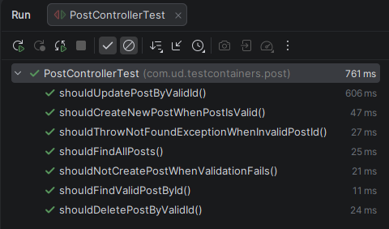

# Getting Started

## springboot test containers
Spring Boot application with TestContainer and WireMock example. 
This application is mainly developed for Integration testing the application functionality from the Controller to the database layer.

### Tools & Frameworks

* Java 21
* Springboot 3.5
* Spring Data JDBC
* Test Containers
* Docker compose
* PostgreSQL

### Integration Testing

1. Database layer: Repository class

       PostRepositoryTest.java

   using the below annotation 
   * @Testcontainers
   * @DataJdbcTest - instead of using @SpringBootTest. will only boot a slice of the spring context used for the database layer.
   * @Container - define the docker image and it will be downloaded from docker hub if not locally available.
   * @ServiceConnection - Spring auto configures the Container with the url and ports. This is a replacement 
     for the previous @DyanmicPropertySource way of configuring a test container.

2. Web application end to end

       PostControllerTest.java

    using the below annotations
    * @Testcontainers
    * @SpringBootTest(webEnvironment = SpringBootTest.WebEnvironment.RANDOM_PORT)
    * @Container
    * @ServiceConnection
    * @Transactional - run the tests in a transaction boundary. This will cause the tests to execute without corrupted states.
    * @Rollback - Undo the transaction after test completes. Keeps the database clean and tests reliable. 
      This prevents one test from affecting another.

### Test Results

  